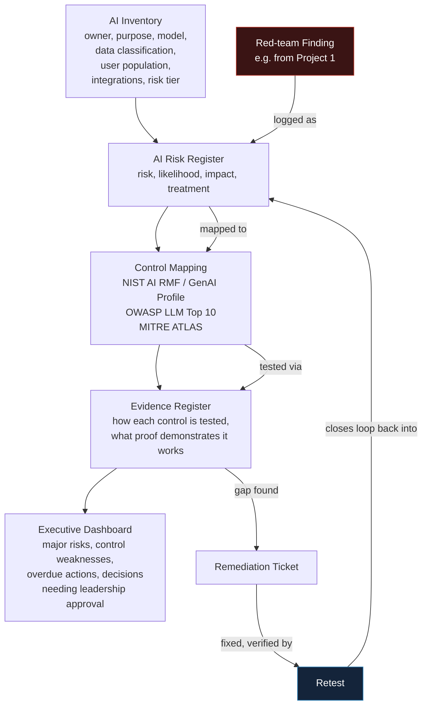

# AI Security and Governance Assurance System
Connects technical security work to business decisions the skill that separates senior candidates
from junior ones, and the one most technically-minded applicants neglect entirely.

## Business Scenario

A fictional organisation, "Northwind Retail," running several AI systems: an employee chatbot, a
customer-support assistant, a coding agent and a decision-support model.

## Architecture

